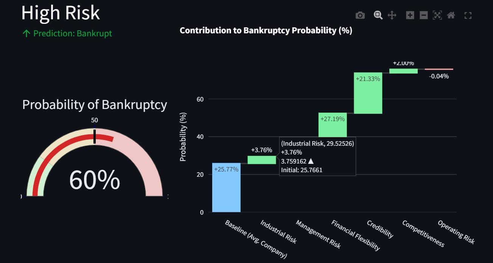
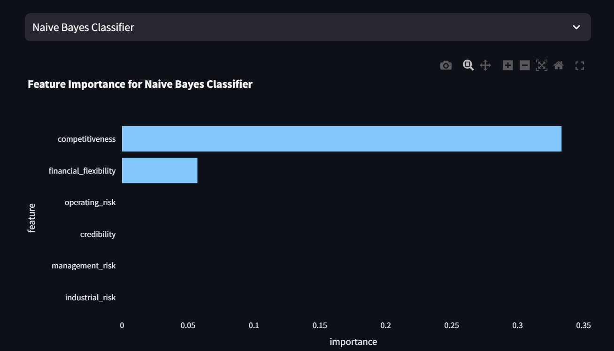
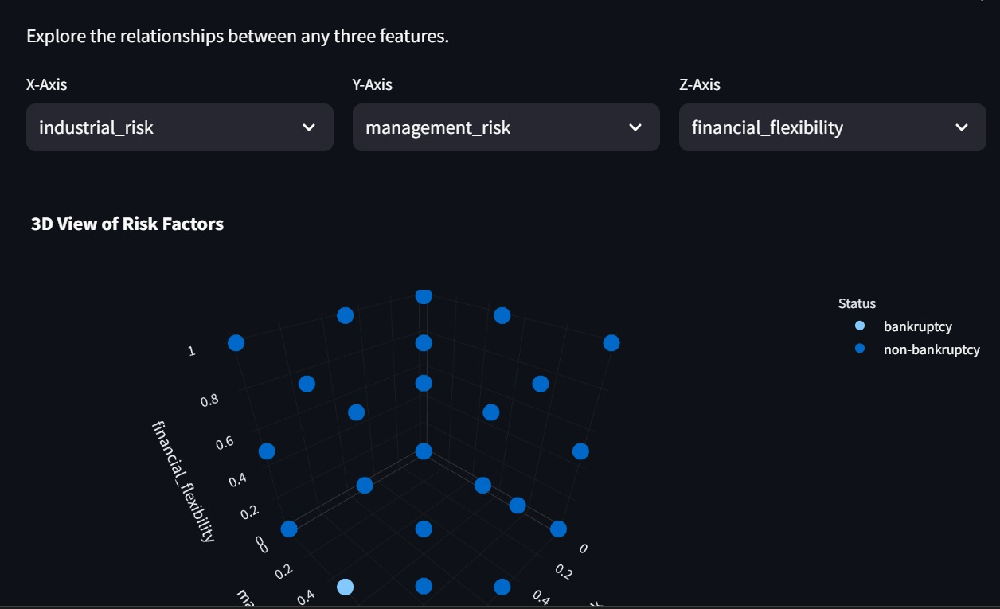

# Bankruptcy Analytics Dashboard

An interactive **Streamlit-based web application** for predicting company bankruptcy risk using classical machine learning models. The app includes a real-time prediction playground, model interpretability via visual analytics, and full dataset exploration tools.

## Live Demo
[Click here to try it on Streamlit Cloud](https://bankruptcy-analytics-platform-bujst3ugcknlk8pmfeka7x.streamlit.app/) 
<h3 align="center">App Screenshots</h3>

  
  
  

---

## Features

- **Prediction Playground**: Simulate bankruptcy risk based on custom input values and receive instant probability feedback.
- **Model Deep Dive**: View and compare feature importances for multiple classification models using permutation importance.
- **Data Explorer**:
  - Pie charts, parallel coordinates, and 3D scatter plots for in-depth exploration.
  - Understand class distributions and multivariate patterns.
- **What-If Analysis**: Waterfall chart shows how each feature affects bankruptcy risk score.
- **Model Ensemble**: Includes 7 classical ML models:
  - Random Forest, Logistic Regression, Decision Tree, SVC, KNN, Bagging, Naive Bayes

---

## Use Cases

- Risk analysis for financial institutions
- Teaching ML interpretability
- Credit scoring prototype development
- Exploring imbalanced classification handling (SMOTE)
